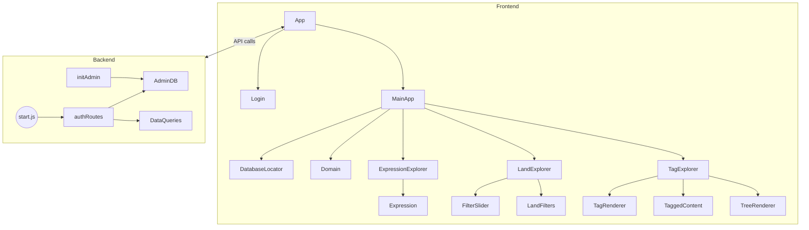

# AGENTS – Contexte Projet MyWebClient

## Directive d'usage pour les agents
- Lire intégralement ce document au démarrage de chaque nouvelle tâche et l’utiliser comme seule source de contexte persisté.
- Considérer les sections « Vue d’ensemble », « Installation & exécution », « Périmètre fonctionnel » et « Architecture » avant toute modification de code ou analyse.
- Mettre à jour ce fichier dès qu’une information de référence change afin d’éviter toute dépendance à d’autres fichiers de notes.

---

## Vue d’ensemble du produit
MyWebClient est l’interface web du projet [MyWebIntelligencePython](https://github.com/MyWebIntelligence/MyWebIntelligencePython). Elle permet de nettoyer, organiser et analyser les données collectées par la pipeline Python. L’application repose sur deux services qui tournent simultanément :
- **Client ReactJS** : interface utilisateur (navigation, édition d’expressions, tagging, sélection de base de données).
- **Serveur Node.js/Express** : API qui lit/écrit dans la base SQLite générée par MyWebIntelligencePython.

### Prérequis essentiels
- Une base SQLite `mwi.db` générée via MyWebIntelligencePython est indispensable. Fournir ce fichier au backend (montage Docker ou chemin local) avant utilisation.
- Node.js 14+ et Yarn si vous exécutez le projet depuis les sources.
- Docker Desktop si vous optez pour l’exécution containerisée.

---

## Installation & exécution

### Option 1 : Docker (recommandée pour un setup rapide)
1. Cloner le dépôt :
   ```bash
   git clone https://github.com/MyWebIntelligence/MyWebClient.git
   cd MyWebClient
   ```
2. Construire l’image :
   ```bash
   docker build -t mwiclient:1.0 .
   ```
3. Démarrer le conteneur en important la base de données MyWebIntelligence :
   ```bash
   docker run -p 80:3000 -p 5001:5001 \
     --name mwiclient \
     -v /chemin/vers/vos/donnees/mywi:/data \
     [-e ADMIN_PASSWORD=motdepasse] \
     [-e RESEND_API_KEY=cle_resend] \
     mwiclient:1.0
   ```
   - Adapter `/chemin/vers/vos/donnees/mywi` pour viser le dossier qui contient `mwi.db`. À l’intérieur du conteneur, l’application recherche la base sous `/data/mwi.db`.
   - `RESEND_API_KEY` est optionnelle : si absente, le backend démarre et désactive simplement l’envoi d’e-mails (mot de passe oublié renvoie 501).
4. Accéder au client via `http://localhost` (port 80 exposé par défaut).

### Option 2 : Exécution depuis les sources
1. Installer les dépendances (client + serveur) :
   ```bash
   yarn install
   ```
2. Fournir le chemin vers la base `mwi.db` dans la configuration (via UI DatabaseLocator ou variables d’environnement si nécessaire).
3. Lancer le mode standalone (client + serveur) :
   ```bash
   yarn standalone
   ```
4. Pour des environnements séparés, utiliser respectivement `yarn start` (client) et `yarn server` (backend).

### Variables d’environnement courantes
- `ADMIN_PASSWORD` (optionnel, utilisé uniquement lors de la **première initialisation** pour définir le mot de passe admin).
- `RESEND_API_KEY` (optionnel, active l’envoi d’e-mails de récupération de mot de passe via Resend).
- Tout mot de passe généré automatiquement est journalisé au démarrage et stocké dans `admin_password.txt` à la racine du projet (ou `/app/admin_password.txt` dans Docker).

### Gestion du compte administrateur
- Si aucun mot de passe n’est fourni lors du premier lancement, `server/src/initAdmin.js` génère un mot de passe sécurisé, l’affiche dans les logs de démarrage et l’écrit dans `admin_password.txt` sous la forme `admin:motdepasse`.
- Pour retrouver le mot de passe en mode local :
  ```bash
  cat admin_password.txt
  ```
- Pour Docker :
  ```bash
  docker exec mwiclient cat /app/admin_password.txt
  ```
  ou consulter `docker logs mwiclient`.

### Commandes Docker utiles
- Lister les conteneurs actifs : `docker ps`
- Arrêter / démarrer le conteneur : `docker stop mwiclient`, `docker start mwiclient`
- Consulter les logs : `docker logs mwiclient`

---

## Périmètre fonctionnel & pipelines applicatifs

### Authentification (Login)
- **Déclencheur** : soumission du formulaire `Login`.
- **Client** : `handleSubmit` envoie `POST /api/auth/login`, stocke le token et appelle `onLogin`.
- **Serveur** : `POST /api/auth/login` valide les identifiants via `AdminDB`, met à jour la session et renvoie `{ success, token, user }`.
- **Résultat** : passage à l’espace applicatif authentifié.

### Exploration / édition d’une expression
- **Déclencheur** : sélection dans `ExpressionExplorer`, actions d’édition ou de navigation.
- **Client** : appels `getExpression`, `getReadable`, `saveReadable`, `deleteExpression`, `tagContent`, `getTaggedContent`, `getPrevExpression`, `getNextExpression`, `deleteMedia` (Context.js).
- **Serveur** : routes correspondantes `/api/expression`, `/api/readable`, `/api/deleteExpression`, `/api/tagContent`, `/api/taggedContent`, `/api/prev`, `/api/next`, `/api/deleteMedia`.
- **Résultat** : consultation, édition, sauvegarde, tagging et navigation en temps réel.

### Exploration et filtrage des “lands”
- **Déclencheur** : `LandExplorer` (changement de land, sliders de filtres).
- **Client** : `getLand`, `getExpressions`, `setCurrentRelevance`, `setCurrentDepth`, pagination (`setCurrentPage`, `setResultsPerPage`).
- **Serveur** : `GET /api/land`, `GET /api/expressions`.
- **Résultat** : exploration filtrée des expressions d’un land.

### Gestion des tags
- **Déclencheur** : actions dans `TagExplorer` ou tagging depuis `Expression`.
- **Client** : `getTags`, `setTags`, `updateTag`, `tagContent`, `getTaggedContent`, `deleteTaggedContent`.
- **Serveur** : `GET /api/tags`, `POST /api/tags`, `POST /api/updateTag`, `POST /api/tagContent`, `GET /api/taggedContent`, `GET /api/deleteTaggedContent`.
- **Résultat** : gestion de la taxonomie et du contenu taggé.

### Sélection de la base de données
- **Déclencheur** : `DatabaseLocator` (choix d’un fichier SQLite).
- **Client** : `setDb` via `GET /api/connect?db=...` suivi du chargement initial des données.
- **Serveur** : `GET /api/connect` connecte le backend à la base spécifiée.
- **Résultat** : initialisation de l’UI avec les données.

### Gestion des domaines
- **Déclencheur** : navigation dans `Domain`.
- **Client** : `getDomain` (Context.js).
- **Serveur** : `GET /api/domain`.
- **Résultat** : consultation des métadonnées d’un domaine.

### Gestion des médias d’expression
- **Déclencheur** : suppression d’un média dans `Expression`.
- **Client** : `deleteMedia` (`POST /api/deleteMedia`).
- **Serveur** : `POST /api/deleteMedia` supprime le média associé.
- **Résultat** : média supprimé, UI mise à jour.

---

## Architecture & structure des dossiers

- **client/** : Frontend React (interface utilisateur)
  - **src/**
    - **index.js** : Point d’entrée React
    - **serviceWorker.js** : Gestion du service worker (PWA)
    - **setupTests.js** : Setup des tests
    - **app/**
      - **Context.js** : Contexte global de configuration (ConfigContext)
      - **Util.js** : Fonctions utilitaires (ex : `delay`)
    - **components/**
      - **App/** : Composant principal `App`, `MainApp`, gestion login
      - **DatabaseLocator/** : Sélection de la base de données
      - **Domain/** : Gestion d’un domaine (`Domain`)
      - **ExpressionExplorer/** : Gestion des expressions (`Expression`, `ExpressionExplorer`)
      - **LandExplorer/** : Exploration des “lands” (`LandExplorer`, `FilterSlider`, `LandFilters`)
      - **TagExplorer/** : Exploration des tags (`TagExplorer`, `TagRenderer`, `TaggedContent`, `TreeRenderer`)

- **server/** : Backend Node.js (API, logique métier)
  - **src/**
    - **AdminDB.js** : Gestion des utilisateurs/admins, logs, tentatives, tokens, accès
    - **DataQueries.js** : Fonctions SQL pour manipuler les données (expressions, tags, etc.)
    - **initAdmin.js** : Création de l’admin initial, génération de mot de passe
    - **authRoutes.js** : Routes d’authentification (login, reset, etc.)
    - **migrations_auth.sql** : Script SQL de migration
    - **start.js** : Point d’entrée serveur

- **Divers**
  - **package.json / yarn.lock** : Dépendances
  - **Dockerfile** / **Dockerfile.prod** : Conteneurisation
  - **docker-compose.yml** / **docker-compose.prod.yml** : Orchestration multi-services
  - **README.md** : Documentation générale du projet
  - **admin_password.txt** : Cache le mot de passe admin généré

---

## Fonctions principales et responsabilités

### Frontend (client/src)

#### serviceWorker.js
- `register(config)` : Enregistre le service worker (PWA)
- `unregister()` : Désenregistre le service worker

#### app/Context.js
- `ConfigContext` (class) : Fournit le contexte global de configuration
- `tagsHaveChanged(a, b, d)` : Compare des tags

#### app/Util.js
- `delay(time, callback, arg)` : Exécute un callback après un délai

#### components/App/App.js
- `MainApp()` : Ancien contenu de `App`, logique principale
- `App()` : Composant principal, gère l’état global et le login
- `handleLogin(userData)` : Callback de connexion

#### components/DatabaseLocator/DatabaseLocator.js
- `DatabaseLocator()` : Permet à l’utilisateur de choisir une base de données

#### components/Domain/Domain.js
- `Domain(props)` : Affiche et gère un domaine

#### components/ExpressionExplorer/Expression.js
- `Expression(props)` : Affiche et édite une expression
  - Fonctions internes : `saveBeforeQuit`, `onTextChange`, `selectText`, `deleteExpression`, `getReadable`, `saveReadable`, `reloadExpression`, `deleteMedia`

#### components/ExpressionExplorer/ExpressionExplorer.js
- `ExpressionExplorer()` : Liste et navigue entre les expressions
  - Fonctions internes : `setPrevPage`, `setNextPage`, `groupSelect`, `checkSelected`, `dropSelected`, `sortHint`

#### components/LandExplorer/LandExplorer.js
- `LandExplorer()` : Affiche et gère l’exploration des “lands”
  - `switchLand(event)` : Change de “land”

#### components/LandExplorer/FilterSlider.js
- `FilterSlider({ label, min, max, defaultValue, apply })` : Slider de filtre
  - `handleChange(event)` : Gère le changement de valeur

#### components/LandExplorer/LandFilters.js
- `LandFilters()` : Filtres pour les “lands”
  - `onChangeRelevance(value)`, `onChangeDepth(value)` : Gèrent les filtres

#### components/TagExplorer/TagExplorer.js
- `TagExplorer()` : Affiche et gère l’exploration des tags
  - Fonctions internes : `getNodeKey`, `handleClose`

#### components/TagExplorer/TagRenderer.js
- `TagRenderer(props)` : Affiche un tag

#### components/TagExplorer/TaggedContent.js
- `TaggedContent({ tags, forLand })` : Affiche le contenu taggé
  - Fonctions internes : `handleClose`, `handleShow`, `deleteTaggedContent`, `getFiltered`

#### components/TagExplorer/TreeRenderer.js
- `TreeRenderer` (class) : Affiche l’arbre des tags
  - `render()` : Rendu de l’arbre

#### Authentification (composants dédiés)
- `Login({ onLogin })`, `ForgotPassword()`, `ResetPassword()` : Composants d’authentification
  - Fonctions internes : `handleSubmit`, `toggleShowPassword`

### Backend (server/src)

#### AdminDB.js
- `connectAdminDB(dbPath)` : Connexion à la base admin
- `addUser(user, callback)` : Ajoute un utilisateur
- `incrementFailedAttempts(userId, maxAttempts, callback)` : Incrémente les tentatives échouées
- `resetFailedAttempts(userId, callback)` : Réinitialise les tentatives
- `findUser(identifier, callback)` : Recherche un utilisateur
- `updateLastSession(userId, callback)` : Met à jour la dernière session
- `addAccessLog(log, callback)` : Ajoute un log d’accès
- `setUserBlocked(userId, blocked, until, callback)` : Bloque/débloque un utilisateur
- `getAccessLogs(userId, callback)` : Récupère les logs d’accès
- `setResetToken(email, token, expires, callback)` : Définit un token de reset
- `findUserByResetToken(token, callback)` : Recherche un utilisateur par token
- `resetPassword(userId, newHash, callback)` : Réinitialise le mot de passe

#### DataQueries.js
- `placeholders(params)` : Génère des placeholders SQL
- `getSiblingExpression(offset, req, res)` : Récupère une expression voisine
- `normPath(filename)` : Normalise un chemin
- `buildTagTree(rows)` : Construit l’arbre des tags
- `walk(tags, parentId)` : Parcours récursif des tags

#### initAdmin.js
- `generatePassword(length)` : Génère un mot de passe
- `logPassword(pwd)` : Log le mot de passe
- `createAdminIfNeeded()` : Crée l’admin si besoin

---

## Schéma des appels de fonctions (simplifié)



---

## Synthèse
Ce fichier est la source de vérité pour les agents. Il décrit l’objectif produit, les procédures d’installation, les pipelines fonctionnels clés, l’architecture et les responsabilités par fichier. Mettre à jour cette page dès qu’une information critique évolue afin de conserver un contexte unique et à jour.
